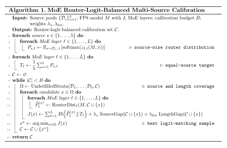

# DeepSeek-W4AFP8-AWQ: Activation-aware Weight Quantization for DeepSeek-V3

**DeepSeek-W4AFP8-AWQ** is a quantization toolkit that applies [AWQ (Activation-aware Weight Quantization)](https://arxiv.org/abs/2306.00978) to Mixture-of-Experts LLMs, specifically targeting **DeepSeek-V3** and its variants. It produces a mixed-precision checkpoint where routed-expert weights are quantized to **INT4** (group-wise, packed into INT8 storage) and eligible remaining linear weights are quantized to **FP8** (E4M3FN, block-wise), preparing the result for integration with a compatible [SGLang](https://github.com/sgl-project/sglang) serving stack.

In the current implementation, routed-expert gate/up/down weights are packed as signed symmetric INT4 with a fixed final group size of 128, while eligible remaining linear weights are stored as E4M3FN FP8 with 128 x 128 block scales. The `--act_qd` option simulates FP8 activations during AWQ scale search; exported expert `input_scale` tensors are currently initialized to a placeholder value of 1.0.

<div align="center">
  
  <br>
  <p>Activation-aware weight quantization</p>
</div>
<div align="center">
  
  <br>
  <p>DeepSeek W4AFP8 mixed-precision quantization</p>
</div>

## Experimental Evaluation

### Evaluation protocol

We evaluate downstream-task accuracy on the complete **GSM8K** test set (1,319 examples, 5-shot) and **MMLU** test set (14,042 examples, 5-shot). `Avg` is the unweighted mean of the two accuracies. Values in parentheses are absolute differences from the FP8 reference; for example, `-0.003` corresponds to a 0.3 percentage-point drop.

The FP8, RTN, GPTQ, QuaRot, and AWQ values below are consolidated from measured experiment results. The final FP8 and AWQ-v4 rows use the SGLang 0.5.9/H20 evaluation configuration, while the retained RTN row comes from an earlier baseline entry. Raw predictions, evaluator commands, and experiment manifests are maintained in the corresponding experiment records outside this repository.

### Main results and comparison baselines

| Method | GSM8K (1,319) | MMLU (14,042) | Avg |
|:---|---:|---:|---:|
| DeepSeek-V3.2-FP8 | 0.950 | 0.882 | 0.9160 |
| DeepSeek-V3.2-RTN-W4AFP8 | 0.942 (-0.008) | 0.867 (-0.015) | 0.9045 (-0.0115) |
| DeepSeek-V3.2-GPTQ-W4AFP8 | 0.943 (-0.007) | 0.870 (-0.012) | 0.9065 (-0.0095) |
| DeepSeek-V3.2-QuaRot-W4AFP8 | 0.943 (-0.007) | 0.873 (-0.009) | 0.9078 (-0.0082) |
| **DeepSeek-V3.2-AWQ-W4AFP8** | **0.947 (-0.003)** | **0.878 (-0.004)** | **0.9125 (-0.0035)** |


The optimized AWQ result remains within **0.35 percentage points** of the FP8 reference on average. As a descriptive comparison of the reported rows—not a controlled attribution across identical runs—AWQ is higher than the retained RTN reference by **0.005** on GSM8K, **0.011** on MMLU, and **0.0080** on average; this corresponds arithmetically to **69.6%** of the RTN-to-FP8 average gap.


### Baseline design

To isolate the contribution of the optimization algorithm, every W4AFP8 baseline should quantize the same MoE expert projections to INT4 with `group_size=128`, retain the same FP8 path for the remaining linear layers, and use the same calibration and evaluation data.

| Baseline | Optimization applied before W4AFP8 packing |
|:---|:---|
| RTN | Group-wise round-to-nearest quantization without reconstruction-aware calibration |
| [GPTQ](https://arxiv.org/abs/2210.17323) | Approximate second-order, layer-wise weight reconstruction |
| [QuaRot](https://arxiv.org/abs/2404.00456) | Rotation-based outlier suppression, adapted to the same mixed-precision layer assignment |
| [AWQ](https://arxiv.org/abs/2306.00978) | Activation-aware per-channel scale search with optional weight clipping |

### Balanced multi-source calibration

Single-source calibration produced noticeably different GSM8K/MMLU trade-offs in our early experiments. For example, WikiText-2 favored GSM8K more strongly, while ShareGPT did not recover MMLU accuracy. This agrees with prior studies showing that calibration-set composition can materially affect downstream quantization performance and generalization ([Williams and Aletras, 2023](https://arxiv.org/abs/2311.09755); [Liu et al., 2024](https://arxiv.org/abs/2406.12928)).

For the AWQ-v4 experiment, we constructed the calibration set offline from **PileVal, C4, WikiText-2, UltraChat, and ShareGPT-GPT4** by matching their contributions in the MoE router-logit space. Rather than forcing every expert to receive uniform traffic, the procedure first computes an equal-source target from the FP8 model's natural routing distributions. It then selects samples greedily so that the running calibration mixture approaches this target at every MoE layer while maintaining source and sequence-length coverage.

<div align="center">
  
</div>


This procedure is designed to balance how different data sources shape the router logits while preserving the FP8 model's natural expert preferences. It limits the influence of any one corpus or prompt format on expert-activation statistics and provides the subsequent AWQ search with broader calibration coverage.

### Serving-speed reference

Our internal benchmark record defines the serving workload as a 4K-token input followed by a 1K-token output. The table below reports the recorded end-to-end DeepSeek-V3.2 FP8 and AWQ-W4AFP8 measurements for 200 successful requests; raw benchmark logs are maintained outside this code release.

| Model | Concurrency | Request throughput (req/s) | Output throughput (tok/s) | Mean E2E (ms) | Mean TTFT (ms) | Mean ITL (ms) |
|:---|---:|---:|---:|---:|---:|---:|
| DeepSeek-V3.2 FP8 | 4 | 0.20 | 209.62 | 19,538.65 | 1,310.92 | 17.87 |
| DeepSeek-V3.2 AWQ-W4AFP8 | 4 | 0.22 | 225.09 | 18,195.57 | 1,177.29 | 16.99 |
| DeepSeek-V3.2 FP8 | 16 | 0.32 | 329.46 | 48,604.03 | 15,472.92 | 32.48 |
| DeepSeek-V3.2 AWQ-W4AFP8 | 16 | 0.39 | 395.59 | 40,373.05 | 5,785.79 | 34.32 |
| DeepSeek-V3.2 FP8 | 100 | 0.32 | 331.53 | 241,196.37 | 193,729.42 | 46.53 |
| DeepSeek-V3.2 AWQ-W4AFP8 | 100 | 0.66 | 671.34 | 152,450.58 | 33,701.93 | 118.04 |

Output-token throughput improves by **7.4%**, **20.1%**, and **102.5%** at requested concurrencies 4, 16, and 100, respectively. At concurrency 100, the higher aggregate throughput comes with a larger mean inter-token latency (118.04 ms versus 46.53 ms), so throughput and per-request latency should be considered jointly.

For full reproducibility, each experiment record should include the checkpoint, quantized-module list, calibration manifest, sequence length, group size, runtime image, attention backend, hardware, evaluation command, and raw task outputs.

## Highlights

- **MoE-aware AWQ**: Builds joint scale-search groups for routed experts, the shared expert's gate/up projections, and the router projection.
- **Mixed INT4 + FP8 weights**: Routed-expert gate/up/down projections use INT4 with a final group size of 128; eligible remaining linear weights use block-scaled FP8.
- **Documented experimental calibration design**: The AWQ-v4 recipe uses an offline selector to combine PileVal, C4, WikiText-2, UltraChat, and ShareGPT-GPT4 against an equal-source target in the MoE router-logit space; this selector is outside the public CLI.
- **SGLang-oriented conversion**: Converts selected checkpoint keys to the naming convention expected by a compatible SGLang W4AFP8 implementation.
- **Memory-conscious pipeline**: Chunked loss computation, optional batched calibration, and layer-by-layer quantization are designed to limit temporary working memory; measured peak-memory results are not yet included.


## Project Structure

```
MoE-AWQ/
├── main.py                              # CLI entry point
├── quantization_core/
│   ├── quantizer.py                     # AwqQuantizer — full AWQ pipeline
│   ├── scaling.py                       # Scale/clip application
│   └── weight_ops.py                    # Group-wise absmax, fake quant, INT/FP8 quant
├── data/
│   └── calibration.py                   # Calibration dataset loaders
├── model/
│   └── loader.py                        # DeepSeek-V3 weight loading (FP8 → BF16)
├── conversion/
│   └── sglang.py                        # SGLang format conversion & indexer weights
├── utils/
│   ├── helpers.py                       # Device detection, memory management
│   └── layer_config.py                  # Layer ignore list & MoE scaling groups
├── quantization/
│   └── utils.py                         # Module introspection & INT8 packing
├── modules/qlinear/
│   └── kernel.py                        # Triton FP8 quantization kernels
└── models/
    ├── modeling_deepseek_v3_dot_1.py    # DeepSeek-V3.1 model architecture
    ├── configuration_deepseek_v3_dot_2.py  # DeepSeek-V3.2 configuration file
    └── modeling_deepseek_v3_dot_2.py       # DeepSeek-V3.2 model architecture file
```

## Requirements

- Python ≥ 3.12
- PyTorch ≥ 2.8 (with CUDA support)
- Triton ≥ 2.1
- Transformers ≥ 4.48
- Additional dependencies:

```bash
pip install accelerate safetensors datasets huggingface_hub tqdm
```

## Quick Start

### 1. Basic Quantization

```bash
python main.py \
    --model_name DeepSeekV32 \
    --model_path /path/to/DeepSeek-V3 \
    --save_path /path/to/output \
    --calib_data pileval \
    --apply_clip
```

### 2. Full Configuration Example

```bash
python main.py \
    --model_name DeepSeekV32 \
    --model_path /path/to/DeepSeek-V3 \
    --save_path /path/to/DeepSeek-V3-MoEAWQ-INT4 \
    --w_bit 4 \
    --group_size 128 \
    --calib_data c4 \
    --max_calib_samples 256 \
    --max_calib_seq_len 2048 \
    --apply_clip \
    --n_parallel_calib_samples 4 \
    --max_chunk_memory 4
```

### 3. Test Mode (First 4 Layers Only)

```bash
python main.py \
    --model_name DeepSeekV32 \
    --model_path /path/to/DeepSeek-V3 \
    --save_path /tmp/test_output \
    --calib_data pileval \
    --test_mode
```

## CLI Arguments

| Argument | Type | Default | Description |
|---|---|---|---|
| `--model_name` | str | *required* | Model implementation: `DeepSeekV31` or `DeepSeekV32` |
| `--model_path` | str | *required* | Path to the pretrained DeepSeek-V3 checkpoint |
| `--save_path` | str | *required* | Output directory for the quantized model |
| `--w_bit` | int | 4 | Weight bit-width for AWQ-targeted layers |
| `--group_size` | int | 128 | Group size used during AWQ search and clipping; final INT4 packing is currently fixed to 128 |
| `--zero_point` | flag | False | Use asymmetric pseudo-quantization during search; exported INT4 weights are currently symmetric |
| `--calib_data` | str | pileval | Calibration dataset (`pileval`, `ultrachat`, `c4`, `wikitext`, `sharegpt4`, or any HF dataset) |
| `--split` | str | train | Dataset split |
| `--act_qd`| flag | False | activation fp8 fakequant |
| `--text_column` | str | text | Text column name in the dataset |
| `--max_calib_samples` | int | 128 | Number of calibration samples |
| `--max_calib_seq_len` | int | 512 | Maximum calibration sequence length |
| `--duo_scaling` | flag | False | Enable dual (activation + weight) scaling |
| `--apply_clip` | flag | False | Enable weight clipping after scale search |
| `--n_parallel_calib_samples` | int | None | Batch size for parallel calibration (memory saver) |
| `--max_chunk_memory` | int | 2 | Chunk-memory units currently converted with 1,024 x 1,024 bytes per unit (MiB), despite the legacy CLI help text labeling them as GB |
| `--test_mode` | flag | False | Only quantize the first 4 layers for quick testing |

## Quantization Strategy

The quantization pipeline processes each decoder layer sequentially:

1. **Activation Collection** — Forward calibration data through the layer, capturing input features for every target linear sub-layer and the MoE block.

2. **Scale Search (AWQ)** — For each scaling group (e.g., post-attention layernorm → expert gate/up projections), grid-search over 20 candidate scaling ratios to minimize the L2 reconstruction error between the pre-quantization output in the loaded model dtype (BF16 in the current loader) and the pseudo-quantized output.

3. **Weight Clipping** *(optional)* — For non-attention linear layers, grid-search for the optimal per-group clipping threshold that minimizes output error after quantization.

4. **Final Quantization**
   - **AWQ-targeted layers** (MoE expert projections matching the ignore-list filter) → INT4 group-wise, packed into INT8 with per-group scale factors.
   - **Other linear layers** (attention projections, etc.) → FP8 (E4M3FN) with block-wise scaling via Triton kernels.
   - **Special layers** (embeddings, layer norms, router gate, lm_head) → kept in original precision.

5. **SGLang Conversion** — Key names are remapped (e.g., `gate_proj.input_scale` → `w3.input_scale`) for compatibility with SGLang's serving engine.

## Serving with SGLang

After quantization, the output directory is intended for loading with a compatible SGLang W4AFP8 implementation. Record the tested SGLang version and a successful smoke-test output before treating a generated checkpoint as deployment-ready:

```bash
python -m sglang.launch_server \
    --model-path /path/to/DeepSeek-V3-MoEAWQ-INT4 \
    --tp 8
```

Refer to the [SGLang documentation](https://github.com/sgl-project/sglang) for detailed serving options.

## References

The following papers describe the methods and toolkits referenced by this project. The presence of a reference does not imply that every method is implemented in the current repository.

```bibtex
@article{lin2023awq,
  title={AWQ: Activation-aware Weight Quantization for LLM Compression and Acceleration},
  author={Lin, Ji and Tang, Jiaming and Tang, Haotian and Yang, Shang and Dang, Xingyu and Han, Song},
  journal={arXiv},
  year={2023}
}

@article{frantar2022gptq,
  title={GPTQ: Accurate Post-Training Quantization for Generative Pre-trained Transformers},
  author={Frantar, Elias and Ashkboos, Saleh and Hoefler, Torsten and Alistarh, Dan},
  journal={arXiv preprint arXiv:2210.17323},
  year={2022}
}

@article{ashkboos2024quarot,
  title={QuaRot: Outlier-Free 4-Bit Inference in Rotated LLMs},
  author={Ashkboos, Saleh and Mohtashami, Amirkeivan and Croci, Maximilian L. and Li, Bo and Cameron, Pashmina and Jaggi, Martin and Alistarh, Dan and Hoefler, Torsten and Hensman, James},
  journal={arXiv preprint arXiv:2404.00456},
  year={2024}
}

@article{williams2023calibration,
  title={On the Impact of Calibration Data in Post-training Quantization and Pruning},
  author={Williams, Miles and Aletras, Nikolaos},
  journal={arXiv preprint arXiv:2311.09755},
  year={2023}
}

@article{liu2024quantizedgeneralization,
  title={Evaluating the Generalization Ability of Quantized LLMs: Benchmark, Analysis, and Toolbox},
  author={Liu, Yijun and Meng, Yuan and Wu, Fang and Peng, Shenhao and Yao, Hang and Guan, Chaoyu and Tang, Chen and Ma, Xinzhu and Wang, Zhi and Zhu, Wenwu},
  journal={arXiv preprint arXiv:2406.12928},
  year={2024}
}

@article{lv2025llmc+,
  title={LLMC+: Benchmarking Vision-Language Model Compression with a Plug-and-play Toolkit},
  author={Lv, Chengtao and Zhang, Bilang and Yong, Yang and Gong, Ruihao and Huang, Yushi and Gu, Shiqiao and Wu, Jiajun and Shi, Yumeng and Guo, Jinyang and Wang, Wenya},
  journal={arXiv preprint arXiv:2508.09981},
  year={2025}
}

@article{angelslim2026,
  title={AngelSlim: A more accessible, comprehensive, and efficient toolkit for large model compression},
  author={Hunyuan AI Infra Team},
  journal={arXiv preprint arXiv:2602.21233},
  year={2026}
}
```

## License

A repository-wide license file is not yet included. Review the copyright and license notices in individual source files before reuse.
